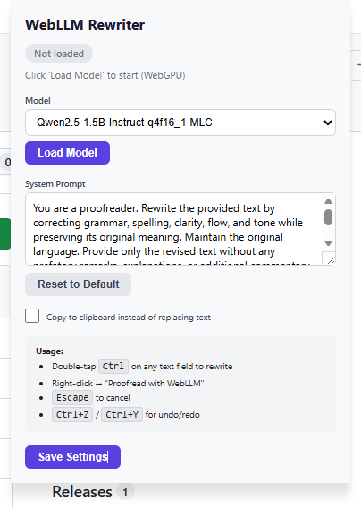

<p align="center">
  
</p>

# WebLLM Rewriter Extension

A Chrome extension for proofreading and rewriting text using local AI via [WebLLM](https://github.com/mlc-ai/web-llm). Runs entirely in your browser with WebGPU acceleration — no data leaves your machine.

**Repository:** [dhhieu113pro/webllm-rewriter-extension](https://github.com/dhhieu113pro/webllm-rewriter-extension)

## Setup

```bash
npm install
npm run build
```

## Load Extension

1. Go to `chrome://extensions/`
2. Enable **Developer mode**
3. Click **Load unpacked**
4. Select the `dist/` directory

## Usage

1. **First load:** The model downloads automatically when the extension starts (requires internet for initial download, ~1GB depending on model). Progress is shown in the popup.
2. **Proofread/Rewrite text:**
   - Place your cursor in any text field or select text
   - Press **Ctrl** twice quickly (double-tap Ctrl) to trigger rewriting
   - Or right-click on an editable field and select **"Proofread with WebLLM"**
3. **Cancel:** Press **Escape** while rewriting to revert to original text
4. **Undo/Redo:** Use **Ctrl+Z** / **Ctrl+Y** to undo/redo rewrites
5. **Settings:** Click the extension icon to open the popup where you can:
   - Change the AI model
   - Customize the system prompt
   - Enable "copy to clipboard" mode instead of inline replacement

## Screenshots

### Settings


### Original Text


### Rewriting in Progress


### Result

